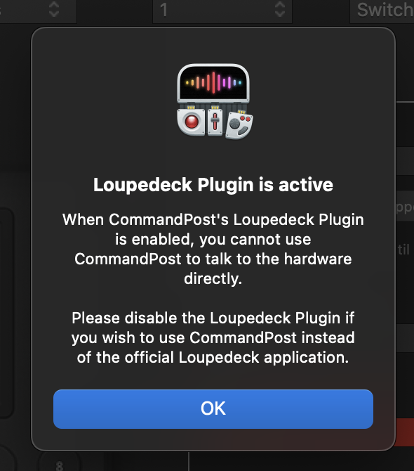
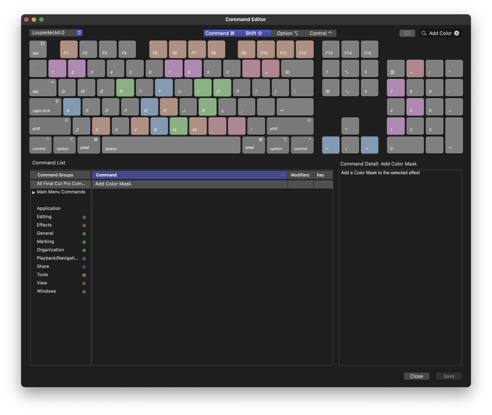

<a href="http://commandpost.io/" > </a>

# [CommandPost](http://commandpost.io/)
[](https://github.com/CommandPost/CommandPost/releases) [](https://commandpost.io/#system-requirements) [](https://commandpost.io/)
> Workflow Enhancements for Creatives

## Loupedeck Plugin for CommandPost

This repository contains a Loupedeck Plugin written in C#, that allows you to connect CommandPost to the official Loupedeck software using the [Loupedeck API](https://github.com/Loupedeck/LoupedeckPluginSdk4).

Once installed you can then trigger a variety of CommandPost actions directly within the Loupedeck software.

**This plugin is bundled within CommandPost, so you should never have to download it directly from this repository - as we'll include a compiled version within CommandPost.**

You can download the latest CommandPost release [here](https://commandpost.io/#download).

This plugin is written and maintained by the CommandPost team, and will remain free and open-source.

Feature requests and bug reports are very much welcome - you can [submit issues here](https://github.com/CommandPost/LoupedeckPlugin/issues).

## Installing the Loupedeck Plugin:

You can download the latest release of CommandPost with the Loupedeck Plugin [here](https://commandpost.io/#download).

You can find general information on how to install CommandPost [here](https://help.commandpost.io/getting-started/installation).

Once CommandPost is installed click on the CommandPost menubar icon, then select "Control Surfaces > Loupedeck Plugin".


This will open the Loupedeck Plugin panel. You can then click the "Enable Loupedeck Plugin" checkbox to enable the plugin.


When installing the Loupedeck Plugin for the first time, or if the Loupedeck Plugin has been updated, CommandPost will restart both the Loupedeck service application and the LoupedeckConfig application.

Once installed, you can access the CommandPost actions from the CommandPost icon within the LoupedeckConfig application.


## CommandPost's Workflow Extension:

The Loupedeck Plugin uses CommandPost's new Workflow Extension to control the timeline playhead in Final Cut Pro.

The Workflow Extension will load automatically when you trigger an action that requires it.

You can learn more about the Workflow Extension [here](https://help.commandpost.io/workflow-extension/workflowextension).


## Known Issues:

- Depending on how many effects, transitions, generators and titles you have installed on your system, the LoupedeckConfig application can be quite slow at loading the list of CommandPost actions. Searching for actions is also incredibly slow. Loupedeck is aware of this and will hopefully fix in a future update.
- Currently changing the language via the LoupedeckConfig application menubar won't automatically update the CommandPost actions in the LoupedeckConfig interface. You'll need to restart both the Loupedeck Service & LoupedeckConfig application for user interface and actions to update. However, most actions will update on the hardware itself. Loupedeck is aware of this and will hopefully fix in a future update.
- Currently there are a bunch of parameters that have a "reset" (i.e. knob press) that doesn't do anything, and the reset commands shouldn't be appearing in the actions list. This is a bug in the Loupedeck API. Loupedeck is aware of this and will hopefully fix in a future update.

## Frequently Asked Questions

As we get questions about the Loupedeck Plugin for CommandPost we'll try and answer them here.

### Does the Loupedeck Plugin override CommandPost's native plugin support?

Yes, if you enable the Loupedeck Plugin, you won't be able to use CommandPost's native/direct Loupedeck CT and Loupedeck Live panel support.

After enabling the Loupedeck Plugin in CommandPost, if you try and enable Loupedeck CT or Loupedeck Live support you'll be presented with the following error message:



To re-enable native support, you'll need to disable the Loupedeck Plugin - you cannot use both at once.

### Can the CommandPost Loupedeck Plugin actions only be used with Final Cut Pro?

No, the CommandPost Loupedeck Plugin is an "Universal" plugin, so you can use it with any application.

To enable CommandPost Loupedeck Plugin actions within the LoupedeckConfig application, select the item next to plugins:


You can then tick "CommandPost" under the "Universal Plugins" list:


### Do I still need to use the Loupedeck4.0 Command Set?

Currently the official Final Cut Pro support for Loupedeck forcefully installs and changes to the Loupedeck4.0 Command Set when you launch the Loupedeck service. There's currently no way to disable this forceful install.

CommandPost does not require a specific Command Set to be installed, as it reads the active Command Set each time you try and trigger a Command Set action.

If you trigger an action that does not have a Command Set applied, you'll be presented with a macOS notification like the below:


When you hover your mouse over the notification, you're presented with the option to "Assign Shortcut":


When you click on "Assign Shortcut" it will take you to the Final Cut Pro Command Editor, and pre-populate the shortcut you want to assign:



## CommandPost Favourites:

Because CommandPost has so many actions, as well as many user customisable actions (such as Lua Snippets), we offer a way for users to manually bring across specific actions from CommandPost to the LoupedeckConfig application.

In the Loupedeck Plugin control surface panel, there's a section for "favourites":


Here you have 50 favourites where you can assign press, turn left and turn right actions from anything in the CommandPost Search Console.

You can learn more about the CommandPost Search Console [here](https://help.commandpost.io/interface/search_console).

In the above screenshot we've assigned "Toggle Mute Volume" to press, "Decrease Volume" to turn left and "Increase Volume" to turn right.

Now within the LoupedeckConfig application, when CommandPost selected, you'll see a new action folder called "CP: Favourites".

You can now apply "Favourite 01" to whatever knob or button you want to trigger the volume controls we set up in CommandPost.


## Loupedeck Marketplace:

Currently the Loupedeck Plugin is bundled within the CommandPost Application.

As a result, the `LoupedeckPackage.yaml` file is actually stored within the main CommandPost repository.

You can access this file [here](https://github.com/CommandPost/CommandPost/blob/issue/2973-loupedeck-plugin/src/plugins/core/loupedeckplugin/plugin/CommandPostPlugin/metadata/LoupedeckPackage.yaml) - noting that it's currently in a seperate branch, not the primary `develop` branch.

You can learn more about the `LoupedeckPackage.yaml` file [here](https://github.com/Loupedeck/LoupedeckPluginSdk4/discussions/2).

## Localisation:

To keep the CommandPost Loupedeck Plugin as simple and as friendly as possible, we use basic JSON files to store all localisation information.

The CommandPost Loupedeck Plugin defaults to using whatever language the LoupedeckConfig application is set to.

Currently if you change the LoupedeckConfig application language, you need to restart the Loupedeck Service and LoupedeckConfig application for the language to be updated in the user interface. We hope to fix this in a future beta.

However, if you change the language in the LoupedeckConfig application, some of the actions will actually update on the hardware displays.

English is regarded as the "hero" language, so if a translation doesn't exist in a language, it will fallback to English by default.

The CommandPost Loupedeck Plugin does contain a bunch of `.xliff` files (found [here](https://github.com/CommandPost/LoupedeckPlugin/tree/main/CommandPostPlugin/CommandPostPlugin/Localization)), but these are essentially just empty dummy files used to tell the Loupedeck API that we support these languages.

Here's an explanation of the JSON files we currently use:

### adjustments.json

This stores all the adjustment (i.e. knob) actions that have a reset (i.e. knob press) in a simple JSON table, where the key is the internal identifier and the value is the group identifier.

For example:

```json
{
  "CommandPostFavourite01":                         "CommandPostFavourites",
  "CommandPostFavourite02":                         "CommandPostFavourites"
}
```

You can modify this file on GitHub [here](https://github.com/CommandPost/LoupedeckPlugin/blob/main/CommandPostPlugin/CommandPostPlugin/JSON/Adjustments/adjustments.json).

### adjustments-noreset.json

This stores all the adjustment (i.e. knob) actions that don't have a reset (i.e. a knob press) in a simple JSON table, where the key is the internal identifier and the value is the group identifier.

For example:

```json
{
  "CommandPostFavourite01":                         "CommandPostFavourites",
  "CommandPostFavourite02":                         "CommandPostFavourites"
}
```

You can modify this file on GitHub [here](https://github.com/CommandPost/LoupedeckPlugin/blob/main/CommandPostPlugin/CommandPostPlugin/JSON/Adjustments/adjustments-noreset.json).

### commands.json

This stores all the commands (i.e. button) actions in a simple JSON table, where the key is the internal identifier and the value is the group identifier.

For example:

```json
{
  "Command Set Shortcuts.General.Paste as Connected": "FCPCommandSet.General",
  "Command Set Shortcuts.Marking.Range Selection Tool": "FCPCommandSet.Marking"
}
```

You can modify this file on GitHub [here](https://github.com/CommandPost/LoupedeckPlugin/blob/main/CommandPostPlugin/CommandPostPlugin/JSON/Commands/commands.json).

### commandsfromwebsocket.json

This stores all the commands (i.e. button) actions that are programatically generated via WebSocket messages in a simple JSON table, where the key is the internal identifier and the value is not currently used.

For example:

```json
{
  "Commands":           "",
  "Shortcuts":          "",
  "KeyboardMaestro":    ""
}
```

This basically just means that when the CommandPost Loupedeck Plugin loads, it will send the following messages to CommandPost:

- `RequestCommands`
- `RequestShortcuts`
- `RequestKeyboardMaestro`

It's then up to CommandPost to send back details about these commands to the Loupedeck Service.

You can modify this file on GitHub [here](https://github.com/CommandPost/LoupedeckPlugin/blob/main/CommandPostPlugin/CommandPostPlugin/JSON/Commands/commandsfromwebsocket.json).

### displaynames-languagecode.json

This file translates a internal identifier (found in the `adjustments.json` and `commands.json`) to a human readable display name that you find in the LoupedeckConfig user interface.

The language code is a two character code, for example: "de", "en", "fr", "ja" and "ko".

For example:

```json
{
  "Video Inspector.Compositing.Opacity":                    "Opacity",
  "Video Inspector.Transform.Position X":                   "Position X",
  "Video Inspector.Transform.Position Y":                   "Position Y"
}
```

You can modify these files on GitHub [here](https://github.com/CommandPost/LoupedeckPlugin/tree/main/CommandPostPlugin/CommandPostPlugin/JSON/DisplayNames).

### groupnames-languagecode.json

This file translate a group identifier to a human readable group display name that you find in the LoupedeckConfig user interface.

For example:

```json
{
  "CommandPostFavourites":                    "CP: Favourites",
  "FCP.Video Inspector":                      "FCP: Video Inspector",
  "FCP.Timeline":                             "FCP: Timeline"
}
```

You can modify these files on GitHub [here](https://github.com/CommandPost/LoupedeckPlugin/tree/main/CommandPostPlugin/CommandPostPlugin/JSON/GroupNames).

### general-languagecode.json

This file contains general translations used by the CommandPost Loupedeck Plugin.

The key is the unique identifier, and the value is the human readable string.

For example:

```json
{
  "CommandPostURL":                           "https://commandpost.io",
  "CommandPostNotRunningError":               "CommandPost is not running.",
  "CommandPostWebSocketError":                "CommandPost is not connected.",
  "CommandPostWebSocketSpecificError":        "WebSocket Server Error: "
}
```

You can modify these files on GitHub [here](https://github.com/CommandPost/LoupedeckPlugin/tree/main/CommandPostPlugin/CommandPostPlugin/JSON/General).

## What is CommandPost?

CommandPost is a **free** and [open source](https://github.com/CommandPost/CommandPost/blob/develop/LICENSE.md) macOS application that bridges between control surfaces and software that doesn’t support them natively, such as Apple’s [Final Cut Pro](https://www.apple.com/final-cut-pro/) and Adobe’s [After Effects](https://www.adobe.com/products/aftereffects.html).

It’s been downloaded over [114 thousand times](https://hanadigital.github.io/grev/?user=commandpost&repo=commandpost), and there are over [2.3 thousands members](https://www.facebook.com/groups/commandpost/members) in our [Facebook Community](https://www.facebook.com/groups/commandpost/).

It’s been translated into Arabic, Bengali, Catalan, Chinese (Simplified), Chinese (Traditional), Danish, Dutch, French, German, Greek, Hindi, Hungarian, Italian, Japanese, Korean, Malayalam, Norwegian, Panjabi/Punjabi, Polish, Portuguese, Russian, Spanish, Swedish, Ukrainian & Vietnamese by our awesome community.

It’s used by filmmakers, developers, scientists and macOS power users all over the world to seriously speed up mundane tasks through powerful and customisable automation tools.

For example, you can apply individual effects within Final Cut Pro or After Effects with the single tap of a button.

Powered by [Lua](https://dev.commandpost.io/lua/overview/) (the same scripting language used by [Blackmagic Fusion](https://www.blackmagicdesign.com/products/fusion/), [Adobe Lightroom](https://www.adobe.com/au/products/photoshop-lightroom.html) and even parts of [Apple iOS](https://twitter.com/_inside/status/1026173832527265792)), it's insanely customisable and powerful.

It runs natively on Apple Silicon and is fully compatible with [Hammerspoon](http://www.hammerspoon.org).

You can listen to Chris explain CommandPost on Final Cut Pro Radio [Episode #57](http://fcpradio.com/episode057.html) and [Episode #43](http://fcpradio.com/episodes/episode043.html).

## CommandPost's Developer Guide:

You can access the Developer Guide [here](http://dev.commandpost.io/). This includes information on Installation & Usage.
[](https://github.com/CommandPost/CommandPost/graphs/contributors)

You can participate in the translation [here](https://poeditor.com/join/project/QWvOQlF1Sy).
[](https://poeditor.com/join/project/QWvOQlF1Sy)

You can also read our Developer Code of Conduct [here](https://github.com/CommandPost/CommandPost/blob/develop/CODE_OF_CONDUCT.md). The source is released under [MIT-License](http://opensource.org/licenses/MIT).
[](https://github.com/CommandPost/CommandPost/blob/develop/LICENSE.md)

## Sponsor:

To help continue CommandPost to grow, evolve, and stay completely free and open-source, we offer the ability to [sponsor CommandPost directly through GitHub](https://github.com/sponsors/commandpost).

